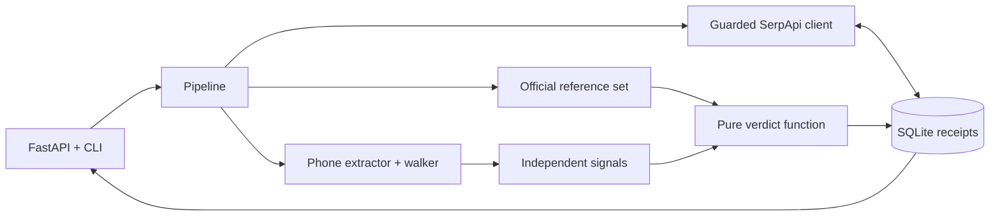

# Architecture

```mermaid
flowchart LR
  UI[FastAPI + CLI] --> P[Pipeline]
  P --> C[Guarded SerpApi client]
  C <--> DB[(SQLite receipts)]
  P --> X[Phone extractor + walker]
  P --> R[Official reference set]
  X --> S[Independent signals]
  R --> V[Pure verdict function]
  S --> V
  V --> DB
  DB --> UI
```

The SQLite receipt store is the seam between live collection and deterministic
replay. The verdict module has no I/O and is the only source of verdicts.

